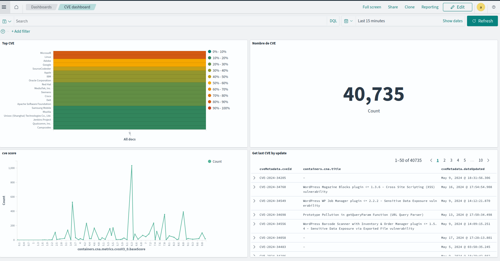

# Table of contents

- [Quick Start](#quick-start)
- [Install Opensearch](#install-opensearch)
- [Get CVE Project](#get-cve-project)

# Quick start

- Create `data.csv` file in the local project with your software and version in this format:

| Software | Version 1 | ... | Version n |
| -- | -- | -- | -- |
| Python | 2.7 | ... | 3.10 |
- Launch Opensearch
- Download CVE list and unzip in the local project
- Launch `load_json_files.py` to fill opensearch
- Launch `request.py` to search CVE with your software

# Install Opensearch


- [Download Opensearch dashboard](https://opensearch.org/downloads.html)

- Launch Opensearch and Opensearch dashboard
```bash
$ docker run -it -p 9200:9200 -p 9600:9600 -e OPENSEARCH_INITIAL_ADMIN_PASSWORD="TQEkc;*ZgPej4A3_S7hC'+" -e "discovery.type=single-node" --rm  --name opensearch-node opensearchproject/opensearch:latest

$ ./opensearch-dashboards-2.14.0/bin/opensearch-dashboards
```


# Get CVE Project
Get last zip of cve in the release section
- [CVEProject](https://github.com/CVEProject/cvelistV5/)
